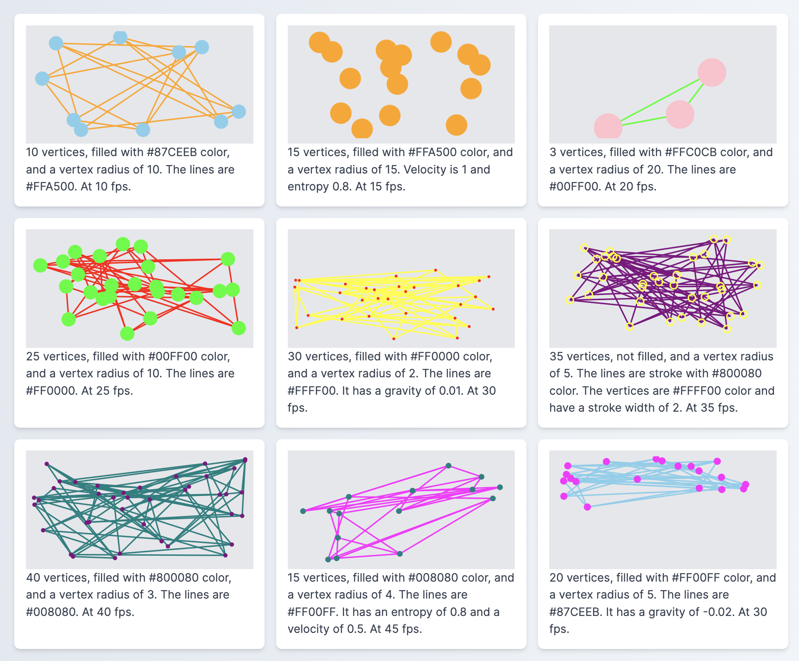

# react-moving-mesh

`react-moving-mesh` is a React component that animates a number of vertices connected by lines, creating a dynamic, moving mesh effect.

- Demo app source code : [https://github.com/stujo/react-moving-mesh-demo](https://github.com/stujo/react-moving-mesh-demo)
- Demo app live : [https://react-moving-mesh-demo.vercel.app/](https://react-moving-mesh-demo.vercel.app/)

## Installation

You can install `react-moving-mesh` from npm:

```bash
npm install react-moving-mesh
```

## Usage

Here's a basic example of how to use the MovingMesh component:

```javascript
import React from "react";
import MovingMesh from "react-moving-mesh";

function App() {
  return (
    <div className="App">
      <MovingMesh />
    </div>
  );
}

export default App;
```

In this example, the MovingMesh component is used in a simple React app. You can customize the MovingMesh component with various props to adjust the appearance and behavior of the mesh.

## Props

Here are the props you can use to customize the MovingMesh component:

- `fps`: Frames per second for the animation. Default value is 15.
- `vertexCount`: Number of vertices in the mesh. Default value is 5.
- `velocity`: Velocity of the vertices. Default value is 0.1.
- `maxVelocity`: Maximum velocity of the vertices. Default value is 1.5.
- `entropy`: Entropy factor affecting the randomness of vertex movement. Default value is 0.9.
- `radius`: Radius of the vertices. Default value is 5.
- `dVelocity`: Delta velocity applied to the vertices. Default value is 0.05.
- `vertexFill`: Fill color of the vertices. Default value is "white".
- `vertexStroke`: Stroke color of the vertices. Default value is "white".
- `vertexStrokeWidth`: Stroke width of the vertices. Default value is 0.
- `lineStroke`: Stroke color of the connecting lines. Default value is "white".
- `lineStrokeWidth`: Stroke width of the connecting lines. Default value is 2.
- `gravity`: Gravity applied to the vertices. Default value is 0.

## Screenshot



## Contributing

Contributions are welcome! Please open an issue if you encounter any problems, or open a pull request if you want to add new features or fix bugs.

## License

react-moving-mesh is MIT licensed.
